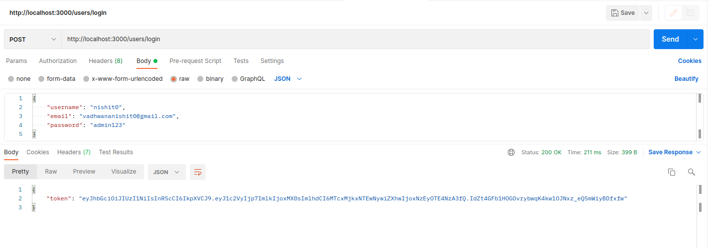
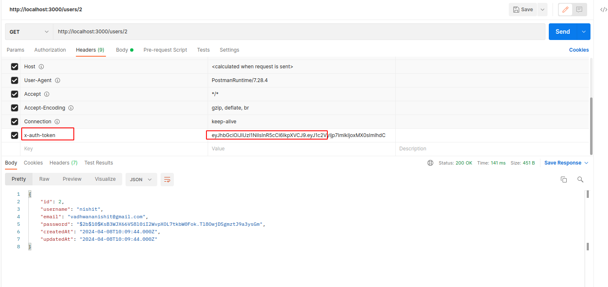

# Microservices in Node.js Example
This application serves as an example of microservices implemented in Node.js. It demonstrates how microservices can be used to handle login, logout, and user CRUD operations. Additionally, a Dockerfile is provided to run these services inside Docker containers with different port numbers.

### Usage
1. Clone this repository.
2. Navigate to the user-service folder.
3. Run `npm install` to install dependencies.
4. Create new DB with `npx sequelize-cli db:create`. Make sure sequelize-cli installed globally in your machine.
5. Start the service using `npm start`.
6. Repeat steps 2-4 for additional microservices as needed.
7. Interact with the microservices using the exposed APIs.

### Service-to-Service Architecture
The goal of this application is to showcase a service-to-service architecture, where each microservice has its own database. Microservices may interact with each other as needed, allowing for greater modularity and scalability.

Feel free to customize and expand upon this example to suit your specific requirements.

Verified in Node Version: v21.6.2

